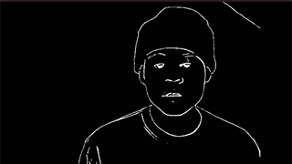

# AI Light Show

This repository hosts the underlying structure for an interactive AI Light Show. The AI video analytics workflow runs on an NVIDIA Jetson Orin with Jetpack 5.0.2. The device comes pre-installed with Python 3.8, GStreamer, TensorRT, OpenCV with CUDA support, TAO-Converter, and PyTorch for Tegra Devices. The light control workflow can run on any macOS or Windows system, and the light control workflows are handled in TouchDesigner.
  
 

  

 
Currently, only the AI workflows are implemented. In the future, the light show will be developed. The final goal is a standalone installation where users are able to physically stand in front of a camera and see their laser projection live in front of them.

## AI Video Analytics Workflow

**Edge Detection - DexiNed:**  
[DexiNed](https://github.com/xavysp/DexiNed) is currently state-of-the-art in edge detection. This model takes a frame and returns an edge map. In this application, DexiNed serves as the foundation for the light show. The edge map is a 1,x,y image with values ranging from 0 to 255. By adjusting a threshold, t, the thickness of the edges can be changed. Extremely high thresholds result in single points, which together form a silhouette of the user. These single points might be projected by a laser projector.

**Face Detection - YuNet:**  
[YuNet](https://github.com/opencv/opencv_zoo/tree/bfac311b2b30de4648307d9939d2f9e33e012007/models/face_detection_yunet) is a light-weight, fast and accurate face detection model. It also provides 5 landmarks. However, they are not used in this application.

**Facial Landmark Estimator - FPENet:**  
[FPENet](https://catalog.ngc.nvidia.com/orgs/nvidia/teams/tao/models/fpenet) is a facial keypoints estimator network, which aims to predict the (x,y) location of keypoints for a given input face image. The resulting landmarks are used for driving a laser beam in the final installation. The given landmarks serve as a grid to draw shapes on the face of a user while the user moves in front of the camera.

## Light Control Workflow

This part is still to be developed! The output of the AI workflow is streamed over a network to another device running TouchDesigner. TouchDesigner controls the light machines to create a dynamic, interactive, AI-driven light show.

## Installation

For DexiNed, download the weights of the model [here](https://drive.google.com/file/d/1V56vGTsu7GYiQouCIKvTWl5UKCZ6yCNu/view). For YuNet, download the .onnx file [here](https://github.com/opencv/opencv_zoo/blob/bfac311b2b30de4648307d9939d2f9e33e012007/models/face_detection_yunet/face_detection_yunet.onnx). For FPENet, download the .etlt file [here](https://catalog.ngc.nvidia.com/orgs/nvidia/teams/tao/models/fpenet/files?version=deployable_v3.0). Create a folder 'engines' and place the files into it.  
 
Then open the 'models' folder. Run 'DexiNed_to_trt.ipynb', 'YuNet_to_trt.ipynb' and 'facial_lmk_to_trt.ipynb'.
 
Now you can run one of the 'main_' notebooks.

## Credits

This project relies on the previous works of multiple authors. We would like to extend our gratitude to:

1. The original authors of the Yunet implementation in OpenCV.
2. The authors of the DexiNed model.
3. Nvidia for providing the landmark detection model in their Transfer Learning Toolkit (TLT) format.

## License

This project is licensed under the terms of the MIT license.

## Contact Information

For any queries, please feel free to reach out to the repository owner.
